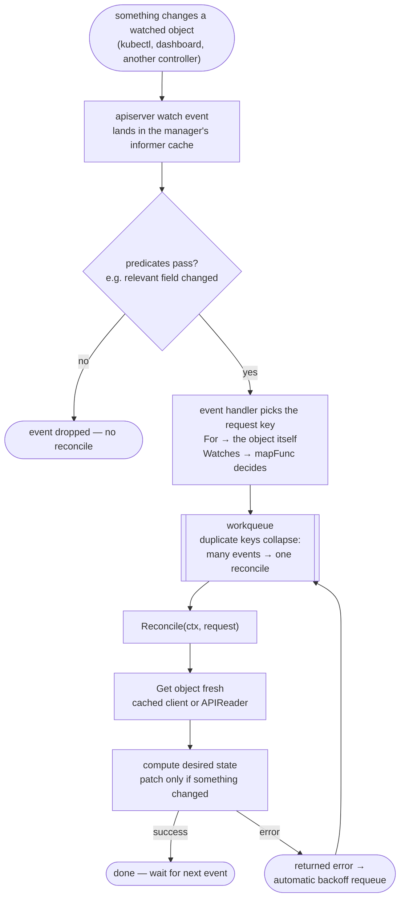
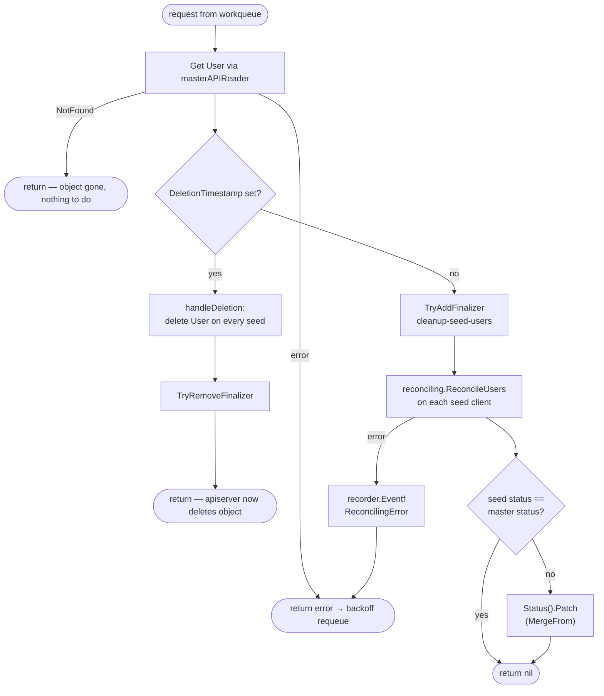
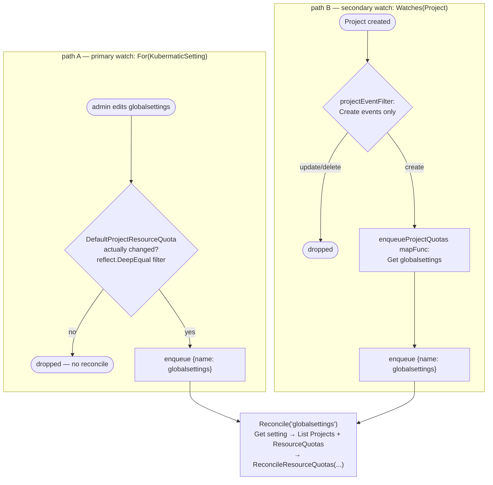
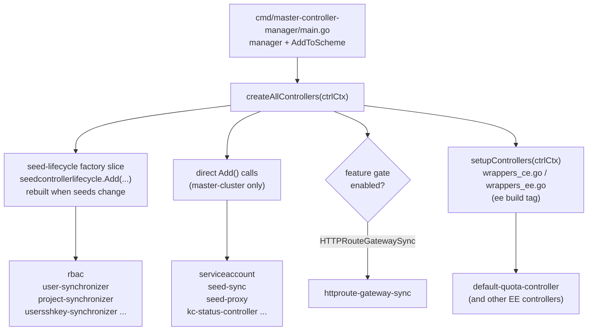
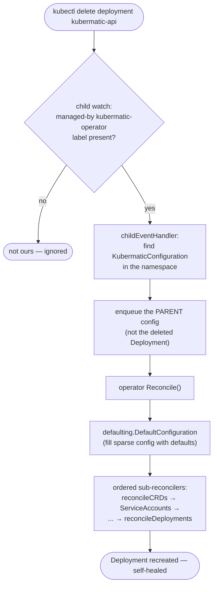

# How Controllers and the Operator Work in KKP

A reference for writing a new controller in this repo, built from real examples. Written while
preparing the admin-group controller (`ai/plans/admin-group-binding-v2.plan.md`, Phase 2), but
general-purpose.

---

## 1. The big picture

KKP is not one program — it ships several controller-manager binaries, each running a set of
controllers against a different cluster:

- **master-controller-manager** (`cmd/master-controller-manager/`) — controllers over
  master-cluster objects: `User`, `Project`, `UserProjectBinding`, `KubermaticSetting`, and
  synchronizers that copy master objects out to seeds.
- **seed-controller-manager** (`cmd/seed-controller-manager/`) — controllers over `Cluster`
  objects and everything inside user-cluster namespaces on a seed (etcd, addons, monitoring…).
- **user-cluster-controller-manager** (`cmd/user-cluster-controller-manager/`) — runs per user
  cluster, reconciles resources inside it.
- **kubermatic-operator** (`cmd/kubermatic-operator/`, code in `pkg/controller/operator/`) —
  installs and manages KKP *itself* from a `KubermaticConfiguration` object (see §5).

Every one of them uses [controller-runtime](https://github.com/kubernetes-sigs/controller-runtime).
The mental model for a single controller:

```
  manager (per binary: shared cache, clients, scheme, event recorder)
      │
      │  Add(mgr, log, numWorkers, ...)       ← each controller package exports this
      ▼
  builder.ControllerManagedBy(mgr)
    .Named(ControllerName)
    .WithOptions(controller.Options{MaxConcurrentReconciles: numWorkers})
    .For(&PrimaryType{}, builder.WithPredicates(...))   ── filtered events ──┐
    .Watches(&SecondaryType{}, mapFunc, predicates)     ── mapped events ────┤
    .Build(reconciler)                                                       ▼
                                                          workqueue (requests deduplicated
                                                           by namespace/name)
                                                                             │
                                                                             ▼
                                                          Reconcile(ctx, request)
                                                          get object → compute desired state
                                                          → patch → emit event on error
```

The same flow as a flowchart — the life of one event, from a `kubectl` edit to a patched object:



Three ideas carry everything:

1. **Level-based, not edge-based.** `Reconcile` receives only a namespace/name. It must re-read
   the world and converge to desired state, no matter which event (or how many, collapsed into
   one) woke it up. A second reconcile with nothing to do must be a no-op.
2. **Predicates decide *whether* an event enqueues; handlers decide *what* gets enqueued.**
   Predicates filter (by name, namespace, label, "did the relevant field change"). Handlers map an
   event to one or more requests — usually the object itself (`For`), sometimes a *different*
   object (`Watches` + map function, see §3).
3. **The cache lags your own writes.** The manager's default client reads from a shared informer
   cache. If a controller mutates the same object it watches, it may read a stale copy next
   reconcile — that's why some controllers read via `GetAPIReader()` (uncached). See §2.

---

## 2. Anatomy of a controller — worked example: user-synchronizer

`pkg/controller/master-controller-manager/user-synchronizer/controller.go` — copies master
`User` objects to every seed cluster. Small, but shows nearly every convention.

### Constants and package layout

Each controller is its own package (`package usersynchronizer`) with a `controller.go`.
Names follow fixed conventions
(`pkg/controller/master-controller-manager/user-synchronizer/controller.go:43-48`):

```go
const (
	ControllerName = "kkp-user-synchronizer"

	// cleanupFinalizer indicates that Kubermatic Users on the seed clusters need cleanup.
	cleanupFinalizer = "kubermatic.k8c.io/cleanup-seed-users"
)
```

`ControllerName` is always `kkp-<thing>`; finalizers are `kubermatic.k8c.io/<verb>-<noun>`.

### The reconciler struct

Holds exactly what `Reconcile` needs — logger, recorder, clients (:50-56):

```go
type reconciler struct {
	log             *zap.SugaredLogger          // named logger: log.Named(ControllerName)
	recorder        events.EventRecorder        // for Kubernetes Events on the reconciled object
	masterClient    ctrlruntimeclient.Client    // cached client for writes
	masterAPIReader ctrlruntimeclient.Reader    // UNCACHED reader — see Reconcile below
	seedClients     kuberneteshelper.SeedClientMap
}
```

### Add() — the wiring entry point

Every controller exports `Add(...)`. It builds the reconciler, then declares watches via the
builder (:58-91):

```go
func Add(masterManager manager.Manager, seedManagers map[string]manager.Manager,
	log *zap.SugaredLogger, numWorkers int) error {

	r := &reconciler{
		log:             log.Named(ControllerName),
		recorder:        masterManager.GetEventRecorder(ControllerName),
		masterClient:    masterManager.GetClient(),
		masterAPIReader: masterManager.GetAPIReader(),
		seedClients:     kuberneteshelper.SeedClientMap{},
	}
	for seedName, seedManager := range seedManagers {
		r.seedClients[seedName] = seedManager.GetClient()
	}

	// don't reconcile service-account "users"
	serviceAccountPredicate := predicate.NewPredicateFuncs(func(object ctrlruntimeclient.Object) bool {
		user := object.(*kubermaticv1.User)
		return !kubermaticv1helper.IsProjectServiceAccount(user.Spec.Email)
	})

	_, err := builder.ControllerManagedBy(masterManager).
		Named(ControllerName).
		WithOptions(controller.Options{MaxConcurrentReconciles: numWorkers}).
		For(&kubermaticv1.User{}, builder.WithPredicates(serviceAccountPredicate, withEventFilter())).
		Build(r)

	return err
}
```

The second predicate, `withEventFilter()` (:93-108), passes Create/Delete/Generic through but
gates Update on `e.ObjectOld.GetGeneration() != e.ObjectNew.GetGeneration()` — generation only
bumps on **spec** changes, so status-only or metadata-only updates don't re-trigger the
controller. (Careful: if your controller must react to annotation or label changes — the
admin-group controller must, its provenance rides on an annotation — a pure generation filter
would swallow those; compare old vs. new fields explicitly instead, like §3's settings filter.)

### Reconcile() — the loop body

`:111-172`, the canonical shape:

```go
func (r *reconciler) Reconcile(ctx context.Context, request reconcile.Request) (reconcile.Result, error) {
	log := r.log.With("request", request)          // per-request logger

	user := &kubermaticv1.User{}
	// using the reader here to bypass the cache. It is necessary because we update the
	// same object we are watching ... Otherwise, the old cache state can overwrite the update.
	if err := r.masterAPIReader.Get(ctx, request.NamespacedName, user); err != nil {
		return reconcile.Result{}, ctrlruntimeclient.IgnoreNotFound(err)
	}

	if !user.DeletionTimestamp.IsZero() {          // object being deleted → cleanup path
		if err := r.handleDeletion(ctx, log, user); err != nil {
			return reconcile.Result{}, fmt.Errorf("handling deletion: %w", err)
		}
		return reconcile.Result{}, nil
	}

	if err := kuberneteshelper.TryAddFinalizer(ctx, r.masterClient, user, cleanupFinalizer); err != nil {
		return reconcile.Result{}, fmt.Errorf("failed to add finalizer: %w", err)
	}

	// ... main work: reconcile the user onto every seed (reconciling framework, §5),
	// then sync status via a MergeFrom patch:
	//   seedClient.Status().Patch(ctx, seedUser, ctrlruntimeclient.MergeFrom(oldSeedUser))

	if err != nil {
		r.recorder.Eventf(user, nil, corev1.EventTypeWarning, "ReconcilingError", "Reconciling", err.Error())
		return reconcile.Result{}, fmt.Errorf("reconciled user %s: %w", user.Name, err)
	}
	return reconcile.Result{}, nil
}
```

Idioms to copy:

- **Uncached read when you mutate what you watch** (`GetAPIReader()`, :114-120 with the
  explanatory comment). Controllers that never write the watched object use the cached client —
  see §3's quota controller.
- **`IgnoreNotFound`** on the initial Get — object deleted between event and reconcile is normal.
- **Deletion via finalizer**: `DeletionTimestamp` set → do external cleanup →
  `TryRemoveFinalizer` (`handleDeletion`, :174-183). `TryAddFinalizer`/`TryRemoveFinalizer`
  (`pkg/kubernetes/`) are retry-safe and no-op when already present/absent.
- **Patch, don't Update**: `ctrlruntimeclient.MergeFrom(oldCopy)` builds a minimal patch —
  fewer conflicts than a full Update (:156-162).
- **Event only on error** (or on meaningful state changes), attached to the reconciled object —
  shows up in `kubectl describe`.

### The Reconcile decision path as a flowchart



### Reference controllers following this same shape

- `pkg/controller/master-controller-manager/project-synchronizer/` — same master→seeds sync,
  same finalizer + `SeedClientMap.Each` structure, for `Project` objects.
- `pkg/controller/master-controller-manager/cluster-template-synchronizer/`,
  `preset-synchronizer/`, `application-definition-synchronizer/`,
  `policy-template-synchronizer/`, `encryption-secret-synchronizer/`,
  `user-project-binding-synchronizer/` — the whole "synchronizer family": one master object
  kind, fanned out to seeds via the reconciling framework.
- `pkg/controller/master-controller-manager/serviceaccount-projectbinding-controller/` — the
  minimal single-cluster variant: one watched type, no seeds, no finalizer fan-out. Good first
  read if user-synchronizer feels dense.
- Note: user-synchronizer is currently the only master controller using `GetAPIReader()` — the
  others don't mutate the object they watch, so the cached client is fine for them.

---

## 3. Watching two types — worked example: default-quota-controller

`pkg/ee/resource-quota/default-quota-controller/controller.go` (EE, `//go:build ee`). It watches
the singleton `KubermaticSetting` *and* `Project` objects — structurally the closest existing
controller to "watch `KubermaticSetting` + `User`".

### The builder: primary + secondary watch (:78-89)

```go
_, err := builder.ControllerManagedBy(mgr).
	Named(ControllerName).
	WithOptions(controller.Options{MaxConcurrentReconciles: numWorkers}).
	For(&kubermaticv1.KubermaticSetting{},
		builder.WithPredicates(utilpredicate.ByName(kubermaticv1.GlobalSettingsName), withSettingsEventFilter())).
	// Watch for creation of Project; we need to make sure that we create default project quotas, if required.
	Watches(&kubermaticv1.Project{}, enqueueProjectQuotas(reconciler.masterClient),
		builder.WithPredicates(projectEventFilter())).
	Build(reconciler)
```

Three techniques stacked here:

**Singleton filtering.** `KubermaticSetting` is a singleton named `globalsettings`;
`utilpredicate.ByName(kubermaticv1.GlobalSettingsName)` drops events for anything else.

**"Only when my field changed" update filter** (:211-234). Instead of the generation trick, it
compares the one spec field this controller cares about:

```go
UpdateFunc: func(e event.UpdateEvent) bool {
	oldSetting, ok := e.ObjectOld.(*kubermaticv1.KubermaticSetting)
	...
	return !reflect.DeepEqual(oldSetting.Spec.DefaultProjectResourceQuota,
		newSetting.Spec.DefaultProjectResourceQuota)
},
```

This is the right template for an `adminGroups`-changed predicate.

**Mapping secondary events onto the primary key** (:264-281). A `Watches` needs a handler that
answers "which requests should this event produce?". Here a Project create enqueues the *settings*
object, so there is exactly one reconcile entry point:

```go
func enqueueProjectQuotas(client ctrlruntimeclient.Client) handler.EventHandler {
	return handler.EnqueueRequestsFromMapFunc(func(ctx context.Context, a ctrlruntimeclient.Object) []reconcile.Request {
		globalSettings := &kubermaticv1.KubermaticSetting{}
		if err := client.Get(ctx, types.NamespacedName{Name: kubermaticv1.GlobalSettingsName}, globalSettings); err != nil {
			utilruntime.HandleError(...)
			return nil
		}
		...
		return []reconcile.Request{{NamespacedName: types.NamespacedName{Name: globalSettings.GetName()}}}
	})
}
```

(The admin-group controller inverts this: `For(&User{})`, and a `Watches` on `KubermaticSetting`
whose map func enqueues *all users* — same mechanism, opposite direction.)

### The simple Reconcile shape (:92-107)

```go
func (r *reconciler) Reconcile(ctx context.Context, request reconcile.Request) (reconcile.Result, error) {
	log := r.log.With("request", request)
	log.Debug("Reconciling")

	setting := &kubermaticv1.KubermaticSetting{}
	if err := r.masterClient.Get(ctx, request.NamespacedName, setting); err != nil {
		return reconcile.Result{}, fmt.Errorf("failed to get global settings %q: %w", setting.Name, err)
	}

	err := r.reconcile(ctx, setting, log)
	if err != nil {
		r.recorder.Eventf(setting, nil, corev1.EventTypeWarning, "ReconcilingError", "Reconciling", err.Error())
	}
	return reconcile.Result{}, err
}
```

Note it uses the **cached** `masterClient` for the Get — safe, because this controller writes
`ResourceQuota` objects, never the `KubermaticSetting` it watches.

### Both trigger paths, one reconcile



The trick to notice: the Project event does **not** get its own reconcile path — the map func
converts it into the primary object's key, so there is exactly one entry point.

### Reference controllers for multi-type watches

- `pkg/ee/resource-quota/default-quota-controller/` — this section's example: singleton primary +
  secondary type mapped onto the primary key.
- `pkg/controller/master-controller-manager/usersshkey-synchronizer/` — three types across
  *different caches* via `WatchesRawSource(source.Kind(seedCache, ...))`.
- `pkg/controller/operator/master/controller.go` — the extreme case: one parent
  (`KubermaticConfiguration`) plus ~10 child types, all mapped back to the parent (§5).
- The planned admin-group controller is the inverted quota shape: `For(&User{})` with a
  `Watches(&KubermaticSetting{}, enqueueAllUsers, ...)` whose map func fans one settings event
  out to *every* user request.

### Advanced case: watching another cluster's cache

`pkg/controller/master-controller-manager/usersshkey-synchronizer/controller.go:88-113` watches
types in *seed* clusters from a master-side controller. That needs `WatchesRawSource` with an
explicit cache:

```go
bldr.WatchesRawSource(source.Kind(
	seedManager.GetCache(),                     // a different cluster's cache
	&corev1.Secret{},
	controllerutil.TypedEnqueueClusterForNamespacedObjectWithSeedName[*corev1.Secret](seedManager.GetClient(), seedName, workerSelector),
	predicateutil.TypedByName[*corev1.Secret](resources.UserSSHKeys),
))
```

Only needed cross-cluster. Two types on the same master cluster (User + KubermaticSetting) need
nothing more than `.For(...).Watches(...)` as above.

---

## 4. Registration — how controllers get started

Writing `Add()` isn't enough; each binary decides which controllers to run.

### master-controller-manager: two mechanisms

`cmd/master-controller-manager/controllers.go`, `createAllControllers` (:60-149):

**(a) Seed-lifecycle factories** (:71-104) — for controllers needing clients to *every seed*
(the synchronizers). They register as `seedcontrollerlifecycle.ControllerFactory` closures;
`seedcontrollerlifecycle.Add(...)` rebuilds and restarts them whenever the set of seeds changes:

```go
controllerFactories := []seedcontrollerlifecycle.ControllerFactory{
	rbacControllerFactory,
	userSynchronizerFactoryCreator(ctrlCtx),
	projectSynchronizerFactoryCreator(ctrlCtx),
	...
}
```

Each factory is a thin adapter (:220-229):

```go
func userSynchronizerFactoryCreator(ctrlCtx *controllerContext) seedcontrollerlifecycle.ControllerFactory {
	return func(ctx context.Context, masterMgr manager.Manager, seedManagerMap map[string]manager.Manager) (string, error) {
		return usersynchronizer.ControllerName, usersynchronizer.Add(masterMgr, seedManagerMap, ctrlCtx.log, ctrlCtx.workerCount)
	}
}
```

**(b) Direct `Add()` calls** (:105-141) — for controllers living purely on the master cluster:

```go
if err := serviceaccount.Add(ctrlCtx.mgr, ctrlCtx.log); err != nil {
	return fmt.Errorf("failed to create serviceaccount controller: %w", err)
}
```

Some are feature-gated (`httproutegatewaysync` behind
`ctrlCtx.featureGates.Enabled(features.HTTPRouteGatewaySync)`, :137-141). The admin-group
controller belongs in this block — it only touches master objects.

**CE/EE split**: the last call, `setupControllers(ctrlCtx)` (:144), is implemented twice —
`wrappers_ce.go` (no-op-ish) and `wrappers_ee.go` (registers EE-only controllers like the
default-quota-controller) — selected by the `ee` build tag.

### seed-controller-manager: name → creator map

`cmd/seed-controller-manager/controllers.go` uses a different style (:61-109): a package-level
map keyed by ControllerName, iterated in `createAllControllers`:

```go
var AllControllers = map[string]controllerCreator{
	kubernetescontroller.ControllerName: createKubernetesController,
	addon.ControllerName:                createAddonController,
	monitoring.ControllerName:           createMonitoringController,
	...
}
type controllerCreator func(*controllerContext) error
```

### Scheme registration

Types must be in the manager's scheme before any client can serialize them — done once per
binary in `main.go`, e.g. `cmd/master-controller-manager/main.go:190`:

```go
if err := kubermaticv1.AddToScheme(mgr.GetScheme()); err != nil { ... }
```

`kubermaticv1` comes from the separate SDK module: `k8c.io/kubermatic/sdk/v2/apis/kubermatic/v1`.

### Registration paths at a glance



seed-controller-manager differs only in shape, not idea: one `AllControllers` map, one loop.

---

## 5. The KKP operator — same machinery, different job

`pkg/controller/operator/` (subpackages `common`, `master`, `seed`, `seed-init`). Its `doc.go`
draws the line: *"all controllers in here must have the sole purpose of reconciling Kubermatic
itself."* So the operator is not a different kind of program — it is ordinary controller-runtime
controllers whose watched object is `KubermaticConfiguration` and whose "desired state" is the
KKP installation (Deployments, Services, webhooks, CRDs…).

```
              ordinary KKP controller                 kubermatic-operator
              ─────────────────────────               ─────────────────────────
  watches     business object (User, Cluster…)        KubermaticConfiguration
                                                       + every child it created
  writes      other business objects / user           the KKP installation itself
              cluster resources                       (Deployments, Services, RBAC,
                                                       webhooks, CRDs)
  answers     "is this User on every seed?"           "does this cluster run the
                                                       KKP described by the config?"
```

### Watch shape: parent + all children

`pkg/controller/operator/master/controller.go` (`ControllerName = "kkp-master-operator"`, :56):

- Primary watch on `KubermaticConfiguration`, filtered by namespace and worker-name label
  (:85-100). Interestingly it uses `.Watches(...)` with an explicit map handler rather than
  `.For(...)` — same effect, since `For` is just `Watches` + `EnqueueRequestForObject`.
- Then it watches **every resource type it creates** — Deployments, ConfigMaps, Secrets,
  Services, ServiceAccounts, Ingresses, PDBs (:134-142), plus cluster-scoped
  ValidatingWebhookConfigurations and ClusterRoleBindings — each mapped back to the parent config
  via `childEventHandler` (:103-132) and filtered by `common.ManagedByOperatorPredicate`:

```go
for _, t := range namespacedResources {
	bldr.Watches(t, childEventHandler, builder.WithPredicates(namespacePredicate, common.ManagedByOperatorPredicate))
}
```

So `kubectl delete deployment kubermatic-api` self-heals: the child event enqueues the config,
and the next reconcile recreates the Deployment.



Child gone is not a special case — the same converge-to-desired-state loop rebuilds it.

### Reconcile: default, then converge, in order

`pkg/controller/operator/master/reconciler.go:118-179` — same skeleton as §2 (deletion cleanup →
`TryAddFinalizer` → work), with one extra step, **defaulting**: the sparse user-provided config is
expanded to a fully-populated one (`defaulting.DefaultConfiguration(config, logger)`, :134)
before an ordered chain of sub-reconcilers runs: `reconcileCRDs`, `reconcileServiceAccounts`,
`reconcileRoles`, … `reconcileDeployments`, `reconcileServices`, `reconcileIngresses`,
`reconcileValidatingWebhooks`.

### The reconciling-helpers framework (`k8c.io/reconciler`)

Every `reconcileXs` step uses the same declarative pattern —
`reconciler.go:509-547` (`reconcileDeployments`) is the canonical instance:

```go
reconcilers := []reconciling.NamedDeploymentReconcilerFactory{
	kubermatic.MasterControllerManagerDeploymentReconciler(config, r.workerName, r.versions, r.httprouteWatchNamespaces),
	common.WebhookDeploymentReconciler(config, r.versions, nil, false),
}
modifiers := []reconciling.ObjectModifier{
	modifier.Ownership(config, common.OperatorName, r.scheme),   // ownerRefs → cascade delete + child watch
	modifier.RelatedRevisionsLabels(ctx, r.Client),
	modifier.VersionLabel(r.versions.GitVersion),
}
if err := reconciling.ReconcileDeployments(ctx, reconcilers, config.Namespace, r.Client, modifiers...); err != nil {
	return fmt.Errorf("failed to reconcile Deployments: %w", err)
}
```

A factory is a function returning `(name, mutator)`; the framework does get-or-create, hands the
*existing* object to the mutator, and patches only if something changed. The smallest complete
example is `projectQuotaReconcilerFactory` (default-quota-controller:236-262):

```go
func projectQuotaReconcilerFactory(resourceQuota *kubermaticv1.ResourceQuota) reconciling.NamedResourceQuotaReconcilerFactory {
	return func() (string, reconciling.ResourceQuotaReconciler) {
		return resourceQuota.Name, func(existing *kubermaticv1.ResourceQuota) (*kubermaticv1.ResourceQuota, error) {
			existing.Spec = resourceQuota.Spec
			// merge labels/annotations into existing ...
			return existing, nil
		}
	}
}
```

Two import paths, easy to confuse: the generic engine is `k8c.io/reconciler/pkg/reconciling`; the
KKP-typed factories (`NamedUserReconcilerFactory`, `ReconcileUsers`, …) are generated into
`k8c.io/kubermatic/v2/pkg/resources/reconciling`.

Use the framework when a controller *creates/owns other objects* (user-synchronizer creating
seed Users, quota controller creating ResourceQuotas). A controller that only flips fields on
the object it watches — the admin-group controller setting `Spec.IsAdmin` + an annotation —
doesn't need it; a plain `MergeFrom` patch is the right size.

---

## 6. Shared utilities toolbox

- `pkg/controller/util/util.go` — enqueue helpers returning `handler.EventHandler`:
  `EnqueueClusterForNamespacedObject`, `EnqueueClusterScopedObjectWithSeedName`,
  `EnqueueProjectForCluster`, `EnqueueObjectWithOperation`, `EnqueueConst` (for controllers with
  no meaningful request key); plus `ConcurrencyLimitReached` /
  `ClusterAvailableForReconciling` — how seed controllers cap simultaneous cluster rollouts.
- `pkg/controller/util/predicate/predicate.go` — predicate factories: `ByName(names...)`,
  `ByNamespace`, `ByLabel`, `ByLabelExists`, `ByAnnotation`, `SkipCreateEvents`, `TrueFilter`,
  and generic `Factory`/`TypedFactory[T]` for one-off filters. Import alias convention:
  `utilpredicate` or `predicateutil`.
- `pkg/util/workerlabel/workerlabel.go` — `LabelSelector(workerName)` and
  `Predicate(workerName)`/`TypedPredicate[T]`: lets several KKP instances (e.g. a dev instance
  with `--worker-name`) share a cluster; objects are partitioned by the
  `worker-name` label, empty worker name matches objects *without* the label.
- `pkg/kubernetes` (imported as `kuberneteshelper`) — `TryAddFinalizer`, `TryRemoveFinalizer`,
  `SeedClientMap.Each`.

---

## 7. Checklist: adding a new master-controller-manager controller

Distilled recipe (what the admin-group controller will follow):

1. **Package** `pkg/controller/master-controller-manager/<name>/` with `controller.go` (+ `doc.go`
   one-liner). `ControllerName = "kkp-<name>"`.
2. **Reconciler struct**: named logger, recorder, client(s); add an `APIReader` field only if the
   controller mutates the type it watches.
3. **`Add(mgr, log, numWorkers) error`**: builder chain — `Named`, `WithOptions`, `For(&Primary{},
   predicates)`, optional `Watches(&Secondary{}, mapFunc, predicates)`, `Build(r)`.
4. **Predicates**: filter as tightly as possible; for Update events compare exactly the fields you
   react to (avoids reconcile loops triggered by your own writes; don't rely on generation checks
   if annotations matter).
5. **Reconcile**: get (uncached if self-mutating, `IgnoreNotFound`), deletion/finalizer path only
   if external cleanup is needed, converge idempotently, write via `MergeFrom` patch only when
   something changed, `Eventf` on error.
6. **Register** in `cmd/master-controller-manager/controllers.go` `createAllControllers` — direct
   `Add()` call for master-only controllers; seed-lifecycle factory only if it needs per-seed
   clients. EE-only controllers register via `wrappers_ee.go` instead.
7. **Tests**: table-driven fake-client tests, pattern in
   `pkg/controller/master-controller-manager/user-synchronizer/controller_test.go` — build objects,
   run `Reconcile`, assert resulting object state; always include a "second reconcile is a no-op"
   case.
