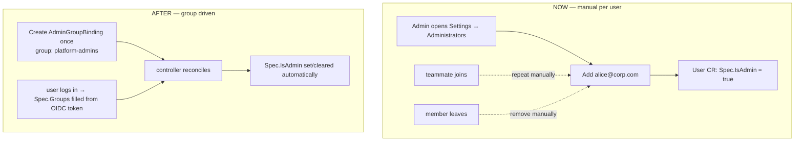
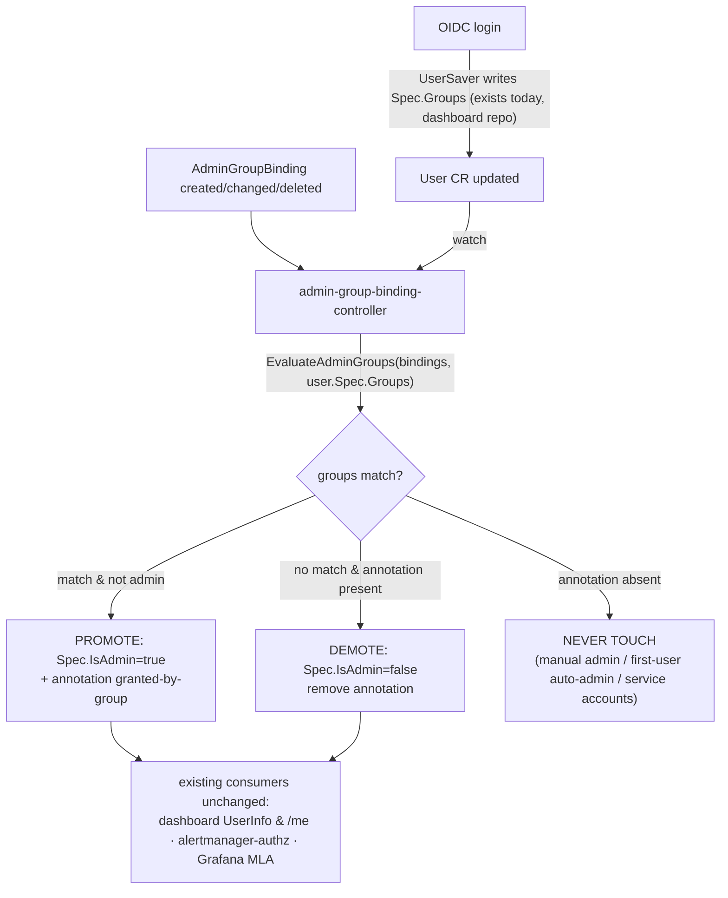

# AdminGroupBinding — Map OIDC Groups to KKP Administrators

**Issue:** [kubermatic/kubermatic#14761](https://github.com/kubermatic/kubermatic/issues/14761) — _[feature-request] Allow mapping groups to be KKP Administrators_
**Milestone:** KKP 2.31 (due 2026-08-24) · **Labels:** customer-request, kind/feature, sig/api, sig/cluster-management, sig/ui
**Classification:** `feat(auth)` / `feat(admin)`

> Single source of truth for this feature — consolidates all prior findings and plans (former `group-admins.plan.md`, `admin-group-binding.plan.md`, `admin-group-binding.progress.md`).

---

## 1. What are we trying to achieve?

Let a KKP installation designate **OIDC / EntraID security groups** as administrators, so admin rights follow group membership in the identity provider automatically — granted when a member logs in, revoked when they leave the group — with no per-user edits.

## 2. What is the issue?

Today KKP admin is a **per-user boolean**: `User.Spec.IsAdmin` (`sdk/apis/kubermatic/v1/user.go:82`, JSON `admin`). Every admin must be flagged individually (dashboard Admin Panel → Administrators, or `kubectl edit user`). In dynamic organizations this means:

- every new teammate → manual promote; every departure → manual demote (churn, and a security gap if forgotten)
- the OIDC `groups` claim is **already stored** into `User.Spec.Groups` on every login (by the dashboard's `UserSaver` middleware) but currently **drives nothing** — the plumbing exists, unused



## 3. What solution did we pick?

A new **cluster-scoped CRD `AdminGroupBinding`** (`kubermatic.k8c.io/v1`), mirroring the existing EE `GroupProjectBinding`, plus a **reconciler** that writes `User.Spec.IsAdmin`. Provenance is tracked with an **annotation on the User object** — no new field on the `User` CRD.

```yaml
apiVersion: kubermatic.k8c.io/v1
kind: AdminGroupBinding
metadata:
  name: platform-admins
spec:
  group: "platform-admins"   # exact OIDC group name, case-sensitive, required
  isAdmin: true              # default true
  isGlobalViewer: false      # optional; mirrors User.Spec.IsGlobalViewer
```

Provenance annotation (already defined, `sdk/apis/kubermatic/v1/admin_group_binding.go:33`):

```
admin.kubermatic.k8c.io/granted-by-group: <binding name>
```

**Why a CRD (not a `KubermaticSetting` field):**
- customer explicitly asked for a CRD ("admin groups should be a CRD, like admin users are")
- direct precedent: `GroupProjectBinding` already maps group → project role; this is the global-admin sibling
- a `globalsettings` field **leaks admin group names**: `/ws/admin/settings` streams full settings to every authenticated user

**Why an annotation (not a new `UserStatus.IsGroupAdmin` field):**
- zero API change to the `User` CRD → no deepcopy/CRD regen, no SDK re-vendor needed just for provenance, dashboard consumers keep working untouched
- carries **more** information than a bool: names *which* binding granted admin ("via group X" badge in UI)
- a new property would have to be handled in the dashboard repo too (SDK re-vendor, API surface, UI model) — annotation is readable through existing object metadata

## 4. How does it solve the issue?

Declare intent **once** in an `AdminGroupBinding`; thereafter membership is driven by the IdP token. The controller keeps `User.Spec.IsAdmin` — the single flag every existing consumer already reads — in sync with group membership:



Three-state reconcile logic:

| User state | Controller behavior |
|---|---|
| annotation present, still in a matching group | leave admin |
| annotation present, no longer in any matching group | **demote** + remove annotation |
| annotation **absent** | never touch — protects manual grants, first-user auto-admin, service accounts |

Because the controller writes `Spec.IsAdmin` (single source of truth), **no existing reader changes**: alertmanager-authorization-server (`cmd/alertmanager-authorization-server/main.go:234`), Grafana MLA (`pkg/controller/seed-controller-manager/mla/user_grafana_controller.go:305`, `org_grafana_controller.go:300`), dashboard `UserInfo` / `/me`.

## 5. Approach — mechanism decision

**Chosen: pure reconciler in this repo** (promotion *and* demotion). `User.Spec.Groups` is already written at login by the dashboard, so every login produces a watch event that triggers reconcile — promotion lands within one reconcile tick of login, no dashboard auth-path change at all.

Alternatives considered — kept for the record:

| | **A. Pure reconciler (chosen)** | B. Promote-at-login + demote-reconciler | C. `adminGroups` field on `KubermaticSetting` |
|---|---|---|---|
| How | controller watches `AdminGroupBinding` + `User`, flips `IsAdmin` + annotation | dashboard `UserSaver` middleware promotes at login; small reconciler demotes offline users | `SettingSpec.AdminGroups []string` + `UserStatus.IsGroupAdmin bool`; controller reconciles |
| Pros | one mechanism, one repo owns auth logic; dashboard needs only UI/CRUD; offline users promoted/demoted too | promotion visible in the very same login request (no tick delay) | no new CRD; rides existing `GET/PATCH /api/v1/admin/settings` for free |
| Cons | promotion lags login by ≤1 reconcile tick (seconds) | auth logic split across two repos + two mechanisms; needs UserSaver 1-min-throttle bypass; more moving parts | **leaks admin group names** to all authenticated users via `/ws/admin/settings`; customer asked for CRD; new `User` CRD field ⇒ must also be handled in dashboard repo (SDK re-vendor, API, UI model) |
| Verdict | ✅ | documented alternate | ❌ rejected |

Provenance-tracking decision (sub-choice of the above):

| | **Annotation (chosen)** | `UserStatus.IsGroupAdmin bool` |
|---|---|---|
| API impact | none — object metadata | new field on `User` CRD: deepcopy + CRD YAML regen + SDK re-vendor in dashboard |
| Information | names the granting binding → "via group X" badge | boolean only |
| Dashboard impact | reads existing metadata | must handle new property (model, API, UI) |
| Typed ergonomics | string lookup | typed field (nicer in Go) |
| Verdict | ✅ | documented alternate |

## 6. Does it require multiple codebases to be updated?

**Yes — two repos**, plus a sequencing constraint:

| Repo | What changes |
|---|---|
| `kubermatic/kubermatic` (this repo) | SDK types ✅ · CRD YAML ✅ · reconciler · validation webhook · operator webhook wiring · RBAC · docs |
| `kubermatic/dashboard` | `modules/api`: v2 CRUD endpoints + provider for `AdminGroupBinding`; `GetAdmins` surfaces the annotation; `SetAdmin` demotion guard. `modules/web`: new "Admin Groups" page, "via group X" badge + disabled delete on Administrators page |

**Sequencing risk:** SDK/CRD must merge + tag upstream **before** the dashboard can re-vendor (`make update-kkp`). Start both PRs early in the 2.31 cycle. With the pure-reconciler approach the dashboard does **not** touch the auth path — its changes are UI/CRUD only, shrinking the cross-repo surface.

---

## 7. Current status (verified against working tree, 2026-07-13)

All staged, uncommitted:

| Item | File | Status |
|---|---|---|
| CRD Go types + `EvaluateAdminGroups` helper + annotation const | `sdk/apis/kubermatic/v1/admin_group_binding.go` | ✅ done |
| Unit test (table-driven: no/empty/matching/case-sensitive/OR) | `sdk/apis/kubermatic/v1/admin_group_binding_test.go` | ✅ done |
| Scheme registration | `sdk/apis/kubermatic/v1/register.go:110` | ✅ done |
| Deepcopy | `sdk/apis/kubermatic/v1/zz_generated.deepcopy.go` | ✅ done |
| Generated CRD YAML (location `master,seed`) | `pkg/crd/k8c.io/kubermatic.k8c.io_admingroupbindings.yaml` | ✅ done |
| codegen locationMap entry | `hack/update-codegen.sh:70` | ✅ done |
| Test fixture `GenAdminGroupBinding` | `pkg/test/generator/objects.go:310` | ✅ done |
| Reconciler | — | ⏳ |
| Validation webhook | — | ⏳ |
| Operator webhook wiring | — | ⏳ |
| RBAC (alertmanager chart, if needed) | — | ⏳ |
| Docs (EntraID GUID caveat) | — | ⏳ |
| Dashboard API + UI | separate repo | ⏳ (UI mockup only: `admin-administrators.png`) |

⚠️ **Drift to fix:** `pkg/crd/k8c.io/kubermatic.k8c.io_users.yaml` was hand-edited (reworded `groups` description) but the source comment in `sdk/apis/kubermatic/v1/user.go:88` was not — `hack/verify-codegen.sh` will fail. Either update the Go comment to match or revert the YAML hunk.

## 8. Remaining work — file map (traced from `GroupProjectBinding` wiring)

`GroupProjectBinding` is the exact template; every remaining item below has a GPB counterpart to copy.

### Phase A — this repo

1. **Reconciler** `pkg/ee/admin-group-binding/controller/{controller,reconciler,doc}.go`
   — model on `pkg/ee/group-project-binding/controller/`. Watches `AdminGroupBinding` + `User`; calls `EvaluateAdminGroups`; promote/annotate, demote/un-annotate, never touch un-annotated users. Also drive `Spec.IsGlobalViewer` (respect the isAdmin/isGlobalViewer mutual exclusion in `pkg/validation/user.go:178`).
   — register: `cmd/master-controller-manager/wrappers_ee.go` (`Add(...)`) + no-op in `wrappers_ce.go`. Master-only (Users live on master; sync-controller for seeds only if a seed-side consumer emerges — GPB's sync-controller pattern available at `pkg/ee/group-project-binding/sync-controller/`).
   — fake-client tests modelled on `pkg/ee/group-project-binding/controller/reconciler_test.go`, matrix: promote / demote-with-annotation / untouched-without-annotation / first-user auto-admin untouched / service account never escalated / idempotent under conflict retry.
2. **Validation webhook** `pkg/webhook/admingroupbinding/validation/{validation,wrappers_ee,wrappers_ce}.go` + EE impl `pkg/ee/validation/admingroupbinding/`
   — model on `pkg/webhook/groupprojectbinding/validation/`. Rules: non-empty group (defense-in-depth over the CRD `MinLength=1`), trim/reject whitespace-only, reject duplicate binding for same group. CE wrapper behavior = decision Q1 below.
   — register in `cmd/kubermatic-webhook/main.go` (~:234, next to GPB's `builder.WebhookManagedBy`).
3. **Operator webhook wiring**
   — const `AdminGroupBindingAdmissionWebhookName` in `pkg/controller/operator/common/resources.go` (~:92)
   — `AdminGroupBindingValidatingWebhookConfigurationReconciler` in `pkg/controller/operator/master/resources/kubermatic/webhooks.go` (model on GPB's at :312)
   — add to reconcile list `pkg/controller/operator/master/reconciler.go:745` and cleanup list `:248`
4. **CRD deployment:** nothing to do — `pkg/crd/fs.go` uses `//go:embed *`; the YAML + `kubermatic.k8c.io/location: master,seed` annotation are already in place. Installer (`pkg/install/stack/kubermatic-master/stack.go:330`) and seed operator (`pkg/controller/operator/seed/reconciler.go:359`) pick it up automatically.
5. **RBAC:** kubermatic-api SA already wildcards `kubermatic.k8c.io/*` (`pkg/controller/operator/master/resources/kubermatic/api.go:63`); operator SA is cluster-admin. Only add `admingroupbindings` to `charts/mla/alertmanager-proxy/templates/authzserver-clusterrole.yaml:20-33` **if** the authz server ever evaluates bindings directly (not needed with the reconciler approach — it reads `IsAdmin`).
6. **Docs:** EntraID caveat — `groups` claim emits **GUIDs** by default, not display names; matching is exact + case-sensitive.

### Phase B — dashboard `modules/api` (after SDK re-vendor via `make update-kkp`)

1. `AdminGroupBindingProvider` interface + EE impl (mirror group-project-binding provider)
2. New `pkg/handler/v2/admin-group-binding/` handlers + routes + swagger in `routes_v2.go`
3. `GetAdmins` (`pkg/provider/kubernetes/admin.go`): surface `grantedByGroup` from the annotation; `SetAdmin`: block demoting annotated users (must remove binding/group instead); guard against self-demotion via binding delete
4. **No `UserSaver` / auth-path change** (pure-reconciler approach)

### Phase C — dashboard `modules/web`

1. New "Admin Groups" page under Admin Panel → Users (clone `src/app/dynamic/enterprise/group/`), route + nav
2. Administrators page: "via group X" badge + disabled delete for annotation-derived rows (mockup: `admin-administrators.png`)

## 9. Verification

1. Fix the `users.yaml`/`user.go` drift → `hack/update-codegen.sh` then `hack/verify-codegen.sh` clean.
2. `cd sdk && go test ./apis/kubermatic/v1/ -run TestEvaluateAdminGroups` (passing today).
3. Reconciler fake-client test matrix (Phase A.1 above).
4. Webhook tests: empty/whitespace/duplicate group (model on `pkg/ee/validation/groupprojectbinding/groupprojectbinding_test.go`).
5. Manual e2e:
   - create binding for own group → log in → Admin Panel appears; `kubectl get users` ADMIN column true; annotation present
   - delete binding / leave group → demoted on next reconcile; annotation gone
   - manual admin also in mapped group → keeps admin after group removed
   - token without `groups` claim → no change
   - EntraID GUID-vs-display-name scenario

## 10. Edge cases

- **Offline users**: reconciler handles both directions — no login needed for demotion.
- **Self-lockout**: blocked at dashboard API; recovery always possible via `kubectl edit user`.
- **First-user auto-admin**: untouched (no annotation).
- **Explicit + group overlap**: user manually promoted *and* later annotated by group logic — v1 accepts that leaving the group demotes them (accept & document; granular source-tracking deferred).
- **Matching**: exact, case-sensitive (consistent with GroupProjectBinding).
- **Service accounts**: no OIDC login path → no `Spec.Groups` → never escalated.

## 11. Open questions (maintainer sign-off)

1. **CE or EE?** GroupProjectBinding is EE-only (CE webhook wrapper rejects with "disabled for the Community Edition"); plain admin management is CE. Plan is written against the EE template (safe default, whole template exists); flipping to CE = move controller out of `pkg/ee/`, drop the ce/ee wrapper pair.
2. Confirm CRD approach vs config field (customer asked for CRD; recommend confirming on the issue).
3. `isGlobalViewer` on the binding — currently modelled **yes** (types already ship it).
4. EntraID GUID group claims — document only (recommended), or resolve display names?

## 12. Acceptance criteria

- [ ] admin can create a group→admin mapping (CRD + dashboard UI)
- [ ] member of a mapped OIDC group gets KKP admin on login without per-user edit
- [ ] removing the binding or group membership revokes admin (including offline users)
- [ ] manually-granted admins unaffected by group logic
- [ ] group-derived admins visible + distinguishable ("via group X") in the Administrators list
- [ ] no leak of admin group names to non-admins
