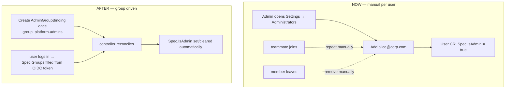
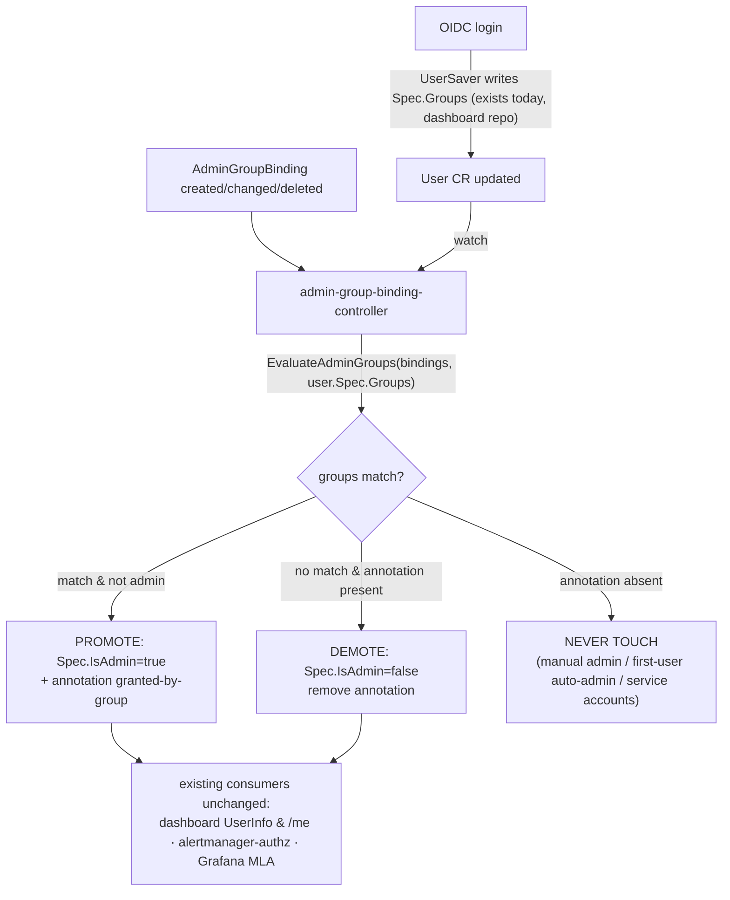

# AdminGroupBinding — Map OIDC Groups to KKP Administrators

**Issue:** [kubermatic/kubermatic#14761](https://github.com/kubermatic/kubermatic/issues/14761) — _[feature-request] Allow mapping groups to be KKP Administrators_
**Milestone:** KKP 2.31 (due 2026-08-24) · **Labels:** customer-request, kind/feature, sig/api, sig/cluster-management, sig/ui
**Classification:** `feat(auth)` / `feat(admin)`

> Implementation status, phased work plan, verification, and open questions live in [admin-group-binding.progress.md](./admin-group-binding.progress.md).

---

## 1. What are we trying to achieve?

Let a KKP installation designate **OIDC / EntraID security groups** as administrators, so admin rights follow group membership in the identity provider automatically — granted when a member logs in, revoked when they leave the group — with no per-user edits.

## 2. What is the issue?

Today KKP admin is a **per-user boolean**: `User.Spec.IsAdmin` (`sdk/apis/kubermatic/v1/user.go:82`, JSON `admin`). Every admin must be flagged individually (dashboard Admin Panel → Administrators, or `kubectl edit user`). In dynamic organizations this means:

- every new teammate → manual promote; every departure → manual demote (churn, and a security gap if forgotten)
- the OIDC `groups` claim is **already stored** into `User.Spec.Groups` on every login (by the dashboard's `UserSaver` middleware) but currently **drives nothing** — the plumbing exists, unused



## 3. What solution did we pick?

A new **cluster-scoped CRD `AdminGroupBinding`** (`kubermatic.k8c.io/v1`), mirroring the existing EE `GroupProjectBinding`, plus a **reconciler** that writes `User.Spec.IsAdmin`. Provenance is tracked with an **annotation on the User object** — no new field on the `User` CRD.

```yaml
apiVersion: kubermatic.k8c.io/v1
kind: AdminGroupBinding
metadata:
  name: platform-admins
spec:
  group: "platform-admins"   # exact OIDC group name, case-sensitive, required
  isAdmin: true              # default true
  isGlobalViewer: false      # optional; mirrors User.Spec.IsGlobalViewer
```

Provenance annotation (already defined, `sdk/apis/kubermatic/v1/admin_group_binding.go:33`):

```
admin.kubermatic.k8c.io/granted-by-group: <binding name>
```

**Why a CRD (not a `KubermaticSetting` field):**
- customer explicitly asked for a CRD ("admin groups should be a CRD, like admin users are")
- direct precedent: `GroupProjectBinding` already maps group → project role; this is the global-admin sibling
- a `globalsettings` field **leaks admin group names**: `/ws/admin/settings` streams full settings to every authenticated user

**Why an annotation (not a new `UserStatus.IsGroupAdmin` field):**
- zero API change to the `User` CRD → no deepcopy/CRD regen, no SDK re-vendor needed just for provenance, dashboard consumers keep working untouched
- carries **more** information than a bool: names *which* binding granted admin ("via group X" badge in UI)
- a new property would have to be handled in the dashboard repo too (SDK re-vendor, API surface, UI model) — annotation is readable through existing object metadata

## 4. How does it solve the issue?

Declare intent **once** in an `AdminGroupBinding`; thereafter membership is driven by the IdP token. The controller keeps `User.Spec.IsAdmin` — the single flag every existing consumer already reads — in sync with group membership:



Three-state reconcile logic:

| User state | Controller behavior |
|---|---|
| annotation present, still in a matching group | leave admin |
| annotation present, no longer in any matching group | **demote** + remove annotation |
| annotation **absent** | never touch — protects manual grants, first-user auto-admin, service accounts |

Because the controller writes `Spec.IsAdmin` (single source of truth), **no existing reader changes**: alertmanager-authorization-server (`cmd/alertmanager-authorization-server/main.go:234`), Grafana MLA (`pkg/controller/seed-controller-manager/mla/user_grafana_controller.go:305`, `org_grafana_controller.go:300`), dashboard `UserInfo` / `/me`.

## 5. Approach

We go with a **reconciler in this repo** that handles both promotion and demotion. The dashboard already writes `User.Spec.Groups` on every login, so each login triggers a watch event and the controller reacts within a reconcile tick. The dashboard's auth path doesn't change at all.

We looked at two other ways of doing this before settling on the reconciler:

**Promote at login, demote via reconciler.** The dashboard's `UserSaver` middleware would flip `IsAdmin` during the login request itself, and a small reconciler in this repo would only handle demoting users who never log in again. The upside is that promotion is visible in the same login request instead of a few seconds later. It wasn't worth it: the admin-granting logic ends up split across two repos and two mechanisms, and `UserSaver` has a 1-minute write throttle that would need a bypass. The reconciler alone covers both directions, including users who are offline.

**A config field instead of a CRD.** The first draft of this plan put an `adminGroups` string list on the `KubermaticSetting` singleton, plus a new `UserStatus.IsGroupAdmin` field to remember which admins were group-derived. It's less code — the existing `GET/PATCH /api/v1/admin/settings` API would carry the field for free. Two things killed it. First, `/ws/admin/settings` streams the full settings object to every authenticated user, so the admin group names would leak to non-admins. Second, any new field on the `User` CRD has to be plumbed through the dashboard repo as well (SDK re-vendor, API surface, UI model). The customer also explicitly asked for a CRD, matching how `GroupProjectBinding` already works.

For remembering *why* someone is an admin, we use the `admin.kubermatic.k8c.io/granted-by-group` annotation on the `User` object rather than a new status field. The annotation needs no API change anywhere, and it stores the name of the granting binding — which is exactly what the UI needs for a "via group X" badge and what the controller needs to know it's allowed to demote. A typed `IsGroupAdmin` bool would be nicer to work with in Go, but it carries less information and drags the dashboard repo into every change.

## 6. Does it require multiple codebases to be updated?

Yes — two repositories:

| Repo | Module | Changes |
|---|---|---|
| `kubermatic/kubermatic` | `sdk/` | `AdminGroupBinding` types, scheme registration, deepcopy, `EvaluateAdminGroups` helper |
| `kubermatic/kubermatic` | `pkg/crd/` | generated CRD YAML (`master,seed`) |
| `kubermatic/kubermatic` | `pkg/ee/` | reconciler (promote/demote + annotation) |
| `kubermatic/kubermatic` | `pkg/webhook/` + operator | validation webhook + `ValidatingWebhookConfiguration` wiring |
| `kubermatic/dashboard` | `modules/api` | v2 CRUD endpoints + provider; `GetAdmins` surfaces annotation; `SetAdmin` demotion guard |
| `kubermatic/dashboard` | `modules/web` | new "Admin Groups" page; "via group X" badge + disabled delete on Administrators page |

| Constraint | Detail |
|---|---|
| Sequencing | SDK/CRD must merge + tag in `kubermatic/kubermatic` **before** the dashboard can re-vendor (`make update-kkp`) — start both PRs early in the 2.31 cycle |
| Auth path | dashboard auth path untouched (reconciler owns all `IsAdmin` writes) — dashboard changes are UI/CRUD only |
