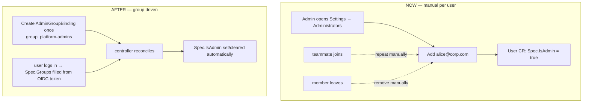
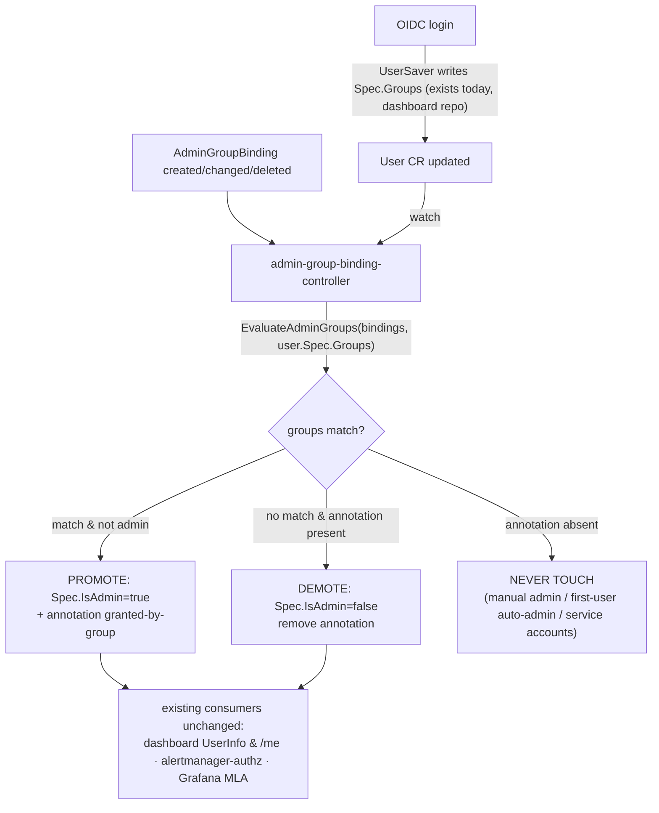
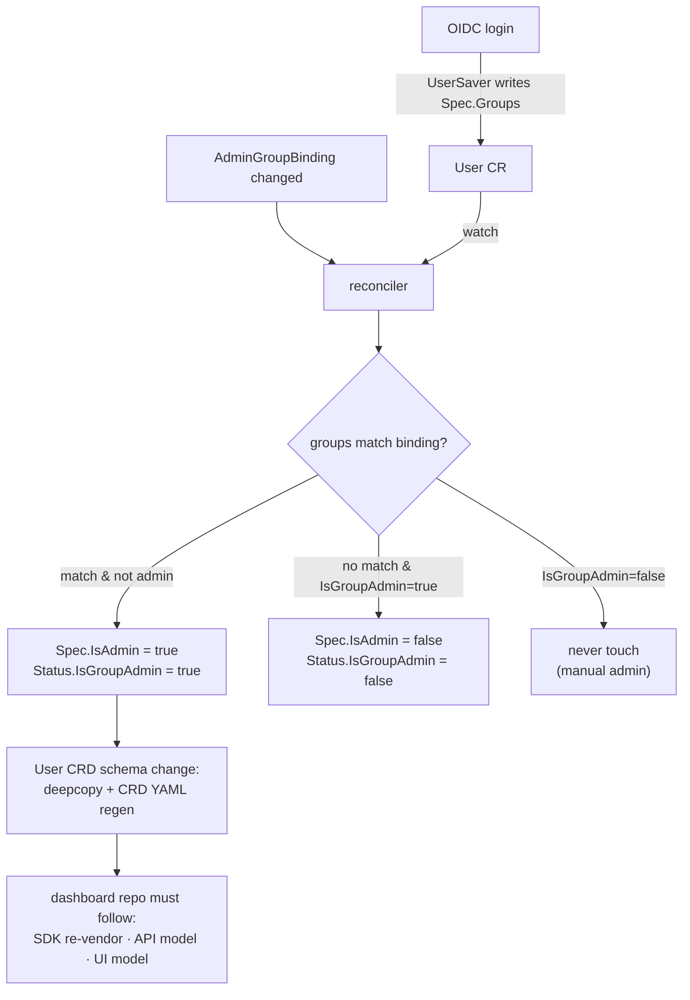
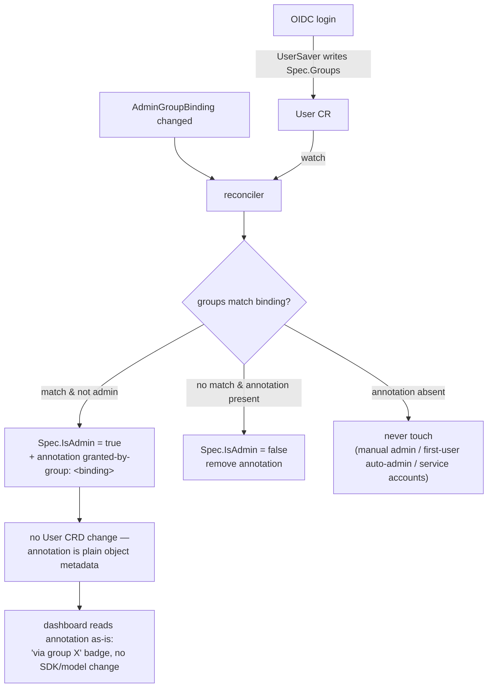
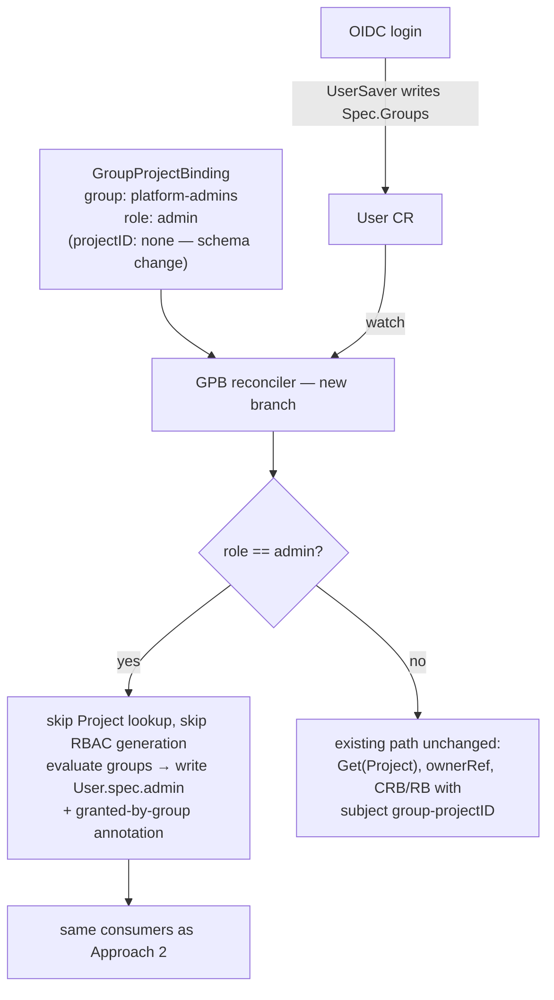

# AdminGroupBinding — Map OIDC Groups to KKP Administrators

**Issue:** [kubermatic/kubermatic#14761](https://github.com/kubermatic/kubermatic/issues/14761) — _[feature-request] Allow mapping groups to be KKP Administrators_
**Milestone:** KKP 2.31 (due 2026-08-24) · **Labels:** customer-request, kind/feature, sig/api, sig/cluster-management, sig/ui
**Classification:** `feat(auth)` / `feat(admin)`

> Implementation status, phased work plan, verification, and open questions live in [admin-group-binding.progress.md](./admin-group-binding.progress.md).

---

## 1. What are we trying to achieve?

Let a KKP installation designate **OIDC / EntraID security groups** as administrators, so admin rights follow group membership in the identity provider automatically — granted when a member logs in, revoked when they leave the group — with no per-user edits.

## 2. What is the issue?

Today KKP admin is a **per-user boolean**: `User.Spec.IsAdmin` (`sdk/apis/kubermatic/v1/user.go:82`, JSON `admin`). Every admin must be flagged individually (dashboard Admin Panel → Administrators, or `kubectl edit user`). In dynamic organizations this means:

- every new teammate → manual promote; every departure → manual demote (churn, and a security gap if forgotten)
- the OIDC `groups` claim is **already stored** into `User.Spec.Groups` on every login (by the dashboard's `UserSaver` middleware) but currently **drives nothing** — the plumbing exists, unused



## 3. What solution did we pick?

A new **cluster-scoped CRD `AdminGroupBinding`** (`kubermatic.k8c.io/v1`), mirroring the existing EE `GroupProjectBinding`, plus a **reconciler** that writes `User.Spec.IsAdmin`. Provenance is tracked with an **annotation on the User object** — no new field on the `User` CRD.

```yaml
apiVersion: kubermatic.k8c.io/v1
kind: AdminGroupBinding
metadata:
  name: platform-admins
spec:
  group: "platform-admins"   # exact OIDC group name, case-sensitive, required
  isAdmin: true              # default true
  isGlobalViewer: false      # optional; mirrors User.Spec.IsGlobalViewer
```

Provenance annotation (already defined, `sdk/apis/kubermatic/v1/admin_group_binding.go:33`):

```
admin.kubermatic.k8c.io/granted-by-group: <binding name>
```

**Why a CRD (not a `KubermaticSetting` field):**
- customer explicitly asked for a CRD ("admin groups should be a CRD, like admin users are")
- direct precedent: `GroupProjectBinding` already maps group → project role; this is the global-admin sibling
- a `globalsettings` field **leaks admin group names**: `/ws/admin/settings` streams full settings to every authenticated user

**Why an annotation (not a new `UserStatus.IsGroupAdmin` field):**
- zero API change to the `User` CRD → no deepcopy/CRD regen, no SDK re-vendor needed just for provenance, dashboard consumers keep working untouched
- carries **more** information than a bool: names *which* binding granted admin ("via group X" badge in UI)
- a new property would have to be handled in the dashboard repo too (SDK re-vendor, API surface, UI model) — annotation is readable through existing object metadata

## 4. How does it solve the issue?

Declare intent **once** in an `AdminGroupBinding`; thereafter membership is driven by the IdP token. The controller keeps `User.Spec.IsAdmin` — the single flag every existing consumer already reads — in sync with group membership:



Three-state reconcile logic:

| User state | Controller behavior |
|---|---|
| annotation present, still in a matching group | leave admin |
| annotation present, no longer in any matching group | **demote** + remove annotation |
| annotation **absent** | never touch — protects manual grants, first-user auto-admin, service accounts |

Because the controller writes `Spec.IsAdmin` (single source of truth), **no existing reader changes**: alertmanager-authorization-server (`cmd/alertmanager-authorization-server/main.go:234`), Grafana MLA (`pkg/controller/seed-controller-manager/mla/user_grafana_controller.go:305`, `org_grafana_controller.go:300`), dashboard `UserInfo` / `/me`.

## 5. Approaches

Both approaches share the same mechanism: a reconciler in this repo watches `AdminGroupBinding` + `User` and writes `User.Spec.IsAdmin` in both directions (promote and demote). The dashboard already writes `User.Spec.Groups` at login, so every login triggers a reconcile — the dashboard auth path never changes. What differs between the two approaches is how the system remembers **why** a user is an admin, which is what protects manually-granted admins from ever being demoted by group logic.

### Approach 1 — new `IsGroupAdmin` property on the `User` CRD

Add `UserStatus.IsGroupAdmin bool`. The reconciler sets it alongside `Spec.IsAdmin`; a user with `IsGroupAdmin: false` is never touched.



Cost: it is a `User` CRD schema change. Deepcopy and CRD YAML must be regenerated here, and the dashboard repo has to re-vendor the SDK and plumb the new property through its API and UI models before it can use it. The field is also just a boolean — it says *that* a group granted admin, not *which* group.

### Approach 2 — annotation on the `User` object (chosen)

No schema change. The reconciler stamps `admin.kubermatic.k8c.io/granted-by-group: <binding name>` (already defined, `sdk/apis/kubermatic/v1/admin_group_binding.go:33`) when promoting, and only demotes users carrying the annotation.



The annotation needs no API change in either repo and carries more information: it names the granting binding, which is exactly what the UI needs for a "via group X" badge and what the controller checks before demoting. The trade-off is ergonomics — a typed bool is nicer in Go than a string lookup — but that is not worth a cross-repo schema change.

### Approach 3 — extend the existing `GroupProjectBinding` with a new `admin` role

Instead of a new CRD, teach the existing GPB to carry global admin: add `admin` to the role enum and let a binding with that role mean "members of this group are KKP administrators." The attraction is real: the CRD, its validation webhook, seed-sync controller, v2 API endpoints, and the project Groups UI already exist and ship today, and admins would manage one kind of group binding instead of two.



It is workable, but not for free — an admin binding has no project, and everything around `GroupProjectBinding` today assumes there is one. The areas it touches:

- **CRD schema** — the role list and the currently-mandatory project reference both change on a CRD that is already shipped to customers.
- **Validation** — new rules to keep the two flavors apart (admin bindings must not name a project, project bindings must).
- **Existing controller** — the current reconcile path (project lookup, ownership, RBAC generation) doesn't apply to admin bindings; it needs a second branch doing what Approach 2's controller would do.
- **Every consumer that lists these bindings** — dashboard group/role resolution and the alertmanager authorization server read all bindings assuming project semantics; each needs to skip admin entries.
- **UI** — the project-level Groups page must not offer the admin role, and a separate Admin-Panel surface is still needed to manage admin bindings — so the UI effort is about the same as with a new CRD.
- **Edition** — `GroupProjectBinding` is Enterprise-only, so extending it makes group-admin automatically EE-only.
