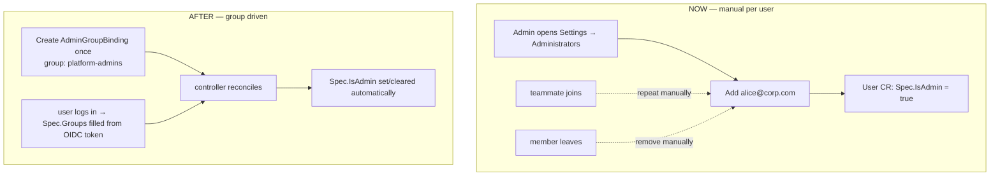
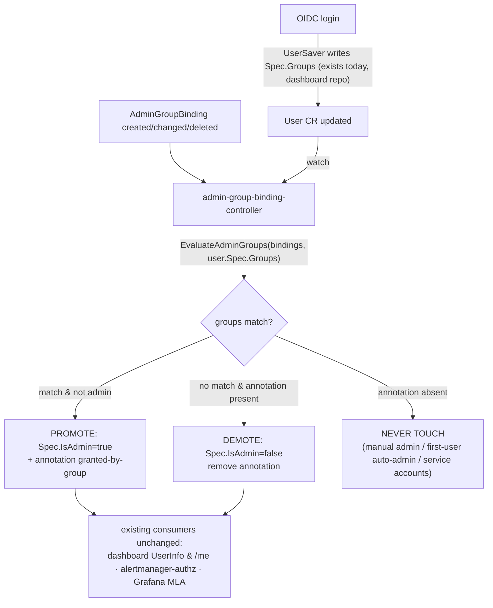
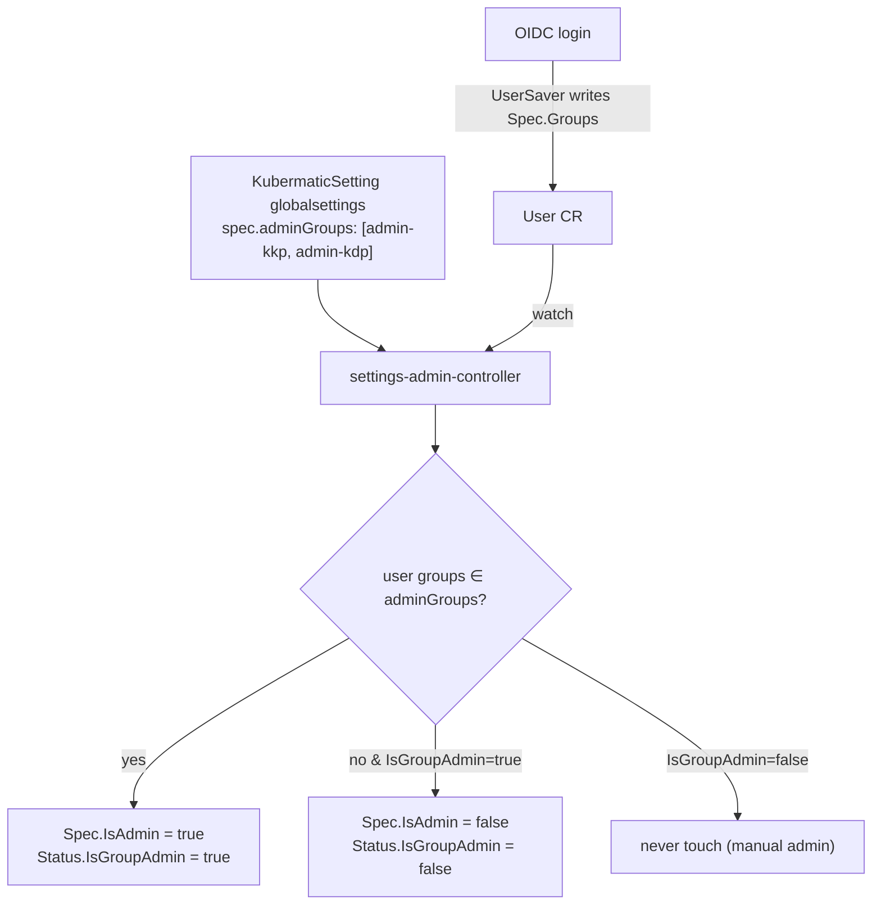
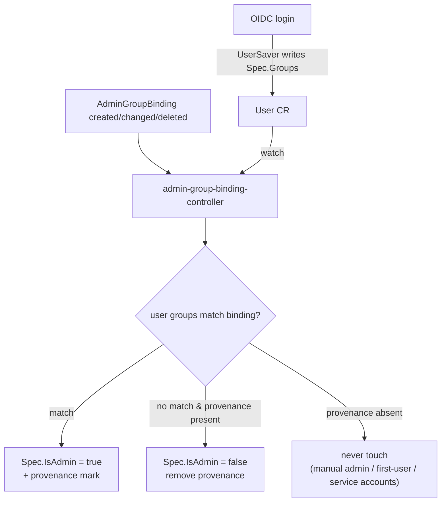
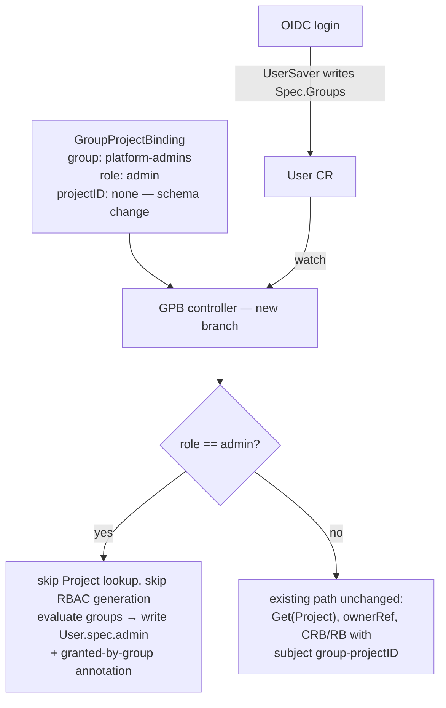

# AdminGroupBinding — Map OIDC Groups to KKP Administrators

**Issue:** [kubermatic/kubermatic#14761](https://github.com/kubermatic/kubermatic/issues/14761) — _[feature-request] Allow mapping groups to be KKP Administrators_
**Milestone:** KKP 2.31 (due 2026-08-24) · **Labels:** customer-request, kind/feature, sig/api, sig/cluster-management, sig/ui
**Classification:** `feat(auth)` / `feat(admin)`

> Implementation status, phased work plan, verification, and open questions live in [admin-group-binding.progress.md](./admin-group-binding.progress.md).

---

## 1. What are we trying to achieve?

Let a KKP installation designate **OIDC / EntraID security groups** as administrators, so admin rights follow group membership in the identity provider automatically — granted when a member logs in, revoked when they leave the group — with no per-user edits.

## 2. What is the issue?

Today KKP admin is a **per-user boolean**: `User.Spec.IsAdmin` (`sdk/apis/kubermatic/v1/user.go:82`, JSON `admin`). Every admin must be flagged individually (dashboard Admin Panel → Administrators, or `kubectl edit user`). In dynamic organizations this means:

- every new teammate → manual promote; every departure → manual demote (churn, and a security gap if forgotten)
- the OIDC `groups` claim is **already stored** into `User.Spec.Groups` on every login (by the dashboard's `UserSaver` middleware) but currently **drives nothing** — the plumbing exists, unused



## 3. What solution did we pick?

A new **cluster-scoped CRD `AdminGroupBinding`** (`kubermatic.k8c.io/v1`), mirroring the existing EE `GroupProjectBinding`, plus a **reconciler** that writes `User.Spec.IsAdmin`. Provenance is tracked with an **annotation on the User object** — no new field on the `User` CRD.

```yaml
apiVersion: kubermatic.k8c.io/v1
kind: AdminGroupBinding
metadata:
  name: platform-admins
spec:
  group: "platform-admins"   # exact OIDC group name, case-sensitive, required
  isAdmin: true              # default true
  isGlobalViewer: false      # optional; mirrors User.Spec.IsGlobalViewer
```

Provenance annotation (already defined, `sdk/apis/kubermatic/v1/admin_group_binding.go:33`):

```
admin.kubermatic.k8c.io/granted-by-group: <binding name>
```

**Why a CRD (not a `KubermaticSetting` field):**
- customer explicitly asked for a CRD ("admin groups should be a CRD, like admin users are")
- direct precedent: `GroupProjectBinding` already maps group → project role; this is the global-admin sibling
- a `globalsettings` field **leaks admin group names**: `/ws/admin/settings` streams full settings to every authenticated user

**Why an annotation (not a new `UserStatus.IsGroupAdmin` field):**
- zero API change to the `User` CRD → no deepcopy/CRD regen, no SDK re-vendor needed just for provenance, dashboard consumers keep working untouched
- carries **more** information than a bool: names *which* binding granted admin ("via group X" badge in UI)
- a new property would have to be handled in the dashboard repo too (SDK re-vendor, API surface, UI model) — annotation is readable through existing object metadata

## 4. How does it solve the issue?

Declare intent **once** in an `AdminGroupBinding`; thereafter membership is driven by the IdP token. The controller keeps `User.Spec.IsAdmin` — the single flag every existing consumer already reads — in sync with group membership:



Three-state reconcile logic:

| User state | Controller behavior |
|---|---|
| annotation present, still in a matching group | leave admin |
| annotation present, no longer in any matching group | **demote** + remove annotation |
| annotation **absent** | never touch — protects manual grants, first-user auto-admin, service accounts |

Because the controller writes `Spec.IsAdmin` (single source of truth), **no existing reader changes**: alertmanager-authorization-server (`cmd/alertmanager-authorization-server/main.go:234`), Grafana MLA (`pkg/controller/seed-controller-manager/mla/user_grafana_controller.go:305`, `org_grafana_controller.go:300`), dashboard `UserInfo` / `/me`.

## 5. Approaches

Three options. All share the same machine: a controller watches the group source + `User`, compares the configured group names against the user's OIDC groups (`EvaluateAdminGroups()`, `sdk/apis/kubermatic/v1/admin_group_binding.go:91`), and writes `User.Spec.IsAdmin` — the single flag every consumer already reads. The dashboard already writes `User.Spec.Groups` at login, so the auth path never changes. What differs is **where the admin group names live**: a settings field, a dedicated CRD, or the existing `GroupProjectBinding`.

### Approach 1 — admin group list in `KubermaticSetting` (Ahmed)

No new CRD. Store admin group names as a list field on the existing `globalsettings`
`KubermaticSetting` (`sdk/apis/kubermatic/v1/settings.go:26`, `SettingSpec` at `:53`) — e.g.
`spec.adminGroups: ["kubermatic:admin-kkp-team", "kubermatic:admin-kdp-team"]`. New controller
watches `KubermaticSetting` + `User`, matches the list against the user's OIDC groups, and sets a
new `Status.IsGroupAdmin` bool on the User CRD to grant admin. Existing readers use a helper
checking `isAdmin || isGroupAdmin`.



**Pros:** no new CRD; admin groups managed on one existing settings object, editable from the
Admin-Panel Defaults UI that already exists; a simple string list, no per-binding objects.

**Concerns:**
- **Leaks admin group names.** `globalsettings` is streamed in full to **every authenticated user**
  via `/ws/admin/settings` — admin group names become visible to all. Security regression a
  dedicated CRD (RBAC-gated) avoids.
- **User CRD schema change** — `Status.IsGroupAdmin` bool → deepcopy + CRD YAML regen here, and
  dashboard SDK re-vendor + model plumbing (same cost as Approach 2 flavor (a)).
- **No per-group provenance** — a flat list + one bool says *that* a group granted admin, not
  *which*; harder to show a "via group X" badge or audit which group to remove.
- **Mixes concerns** — `KubermaticSetting` is a grab-bag of dashboard prefs; putting a security
  authorization control there is an odd fit and widens who can edit an admin-granting field.

### Approach 2 — dedicated `AdminGroupBinding` CRD (recommended)

New cluster-scoped CRD carrying just a group name + `isAdmin`/`isGlobalViewer`. New controller watches `AdminGroupBinding` + `User`; on any change it matches the binding's group against the user's OIDC groups and promotes/demotes. Provenance is tracked so **manual admins are never demoted by group logic**.



**Provenance — one sub-decision:**

- **(a) new `Status.IsGroupAdmin` bool on the User CRD** — User schema change → deepcopy + CRD YAML regen here, and dashboard must re-vendor the SDK and plumb the property through its API + UI models. Bool only: says *that* a group granted admin, not *which*.
- **(b) annotation `admin.kubermatic.k8c.io/granted-by-group: <binding>`** (already defined, `admin_group_binding.go:33`) — no schema change in either repo; names *which* binding granted admin (drives a "via group X" badge); dashboard reads it as plain object metadata. **Pick (b).**

**Pros:** clean semantics — the CRD name says what it does; no project baggage; provenance (b) needs zero API change; independent of the EE-only `GroupProjectBinding`.
**Cons:** net-new CRD + controller + validation webhook + Admin-Panel UI surface to build; admins now learn two binding kinds (GPB for projects, AGB for admin).

### Approach 3 — reuse `GroupProjectBinding` with a new `admin` role

No new CRD. Add `admin` to the GPB role enum; a binding with `role: admin` and empty `projectID` means "members of this group are KKP administrators." A new branch in the GPB controller skips the project/RBAC path and instead evaluates groups → writes `User.Spec.IsAdmin` + the provenance annotation.



**Pros:** reuses the shipped CRD, its webhook, seed-sync controller, v2 API endpoints, and Groups UI plumbing; one binding kind to manage.

**Concerns (why it costs more than it looks):**
- `projectID` is today **mandatory and immutable** (webhook-enforced). Admin bindings have no project → must make it optional and relax the webhook = **schema change on a CRD already shipped to customers.**
- **Misleading name:** a "Group**Project**Binding" with no project confuses admins and GitOps authors.
- **Every consumer assumes project semantics** — dashboard project list, `MapUserToGroups`, the alertmanager authorization server all read GPBs expecting a projectID; each must learn to skip admin/empty-projectID entries.
- **Controller split:** the existing reconcile (project lookup, ownerRef, RBAC generation) doesn't apply to admin bindings; needs a second branch doing exactly what Approach 2's controller does.
- `GroupProjectBinding` is **EE-only** → group-admin becomes EE-only by inheritance.
- A separate Admin-Panel UI surface is still needed regardless → **UI savings ≈ zero.**

### Recommendation

**Approach 2, provenance flavor (b) — annotation.** It keeps admin semantics on their own clean CRD, avoids mutating a shipped customer CRD and its validation rules, and the annotation carries more information than a bool at no cross-repo cost. Approach 1 (settings list) is rejected on security — `globalsettings` leaks admin group names to every authenticated user — plus it still costs a User CRD change and drops per-group provenance. Approach 3 (GPB reuse) savings are mostly illusory once the projectID relaxation, consumer fan-out, and still-required UI are counted.
